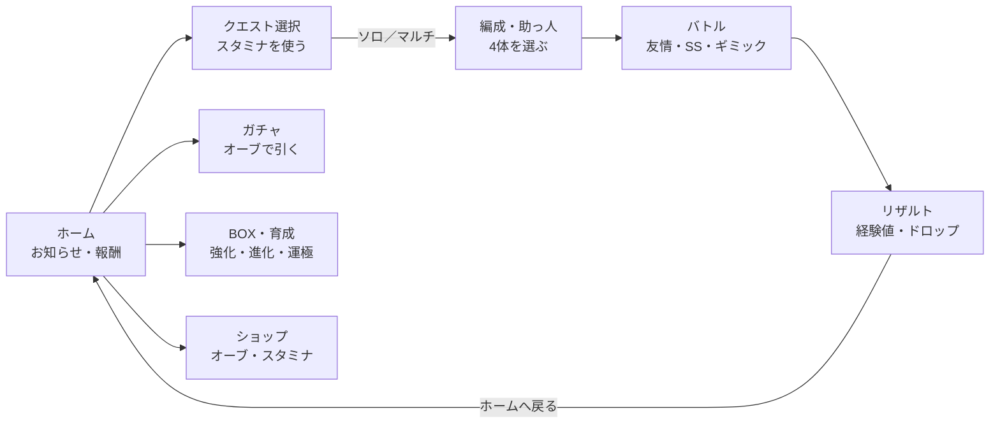

# ひっぱりストライク 開発まとめ

2026-09-29 時点。モンスターストライク風のひっぱりアクション「ひっぱりストライク」を作った記録と、モンスターストライクの調査報告書をまとめたファイルです。

- 1〜5章：作ったもの（ゲーム・安全対策）
- 6章：残っている作業
- 7章：モンスターストライク調査報告書（全文）

---

## 1. 作ったもの一覧

| 成果物 | 場所 | 状態 |
| --- | --- | --- |
| ゲーム本体（1ファイル） | `monster-strike/index.html` | フェーズ1〜4まで完成 |
| 遊べるページ | https://claude.ai/artifact/WfbsVoEKbmGY4zKxvb1KDw | 最新版（フェーズ4）を公開中。非公開（本人のみ） |
| 調査報告書（共同編集できるドキュメント） | https://claude.ai/code/artifact/fdc7eefc-3c0e-4ff7-8fb1-291c005e9533 | 作成済み。内容は7章と同じ |
| ネット参照の禁止リスト | `.claude/blocked-domains.txt` と `.claude/hooks/block-domains.sh` | 動作中 |
| テスト | `monster-strike/tests/` | 静的検査・ロジック70件・ブラウザ43件、すべて成功 |
| CI・公開設定 | `.github/workflows/ci.yml`、`.github/workflows/pages.yml` | CI対象に追加済み。Pages はデフォルトブランチへマージ後に反映 |

作業ブランチは `claude/monster-strike-phase1-m8rna6` です。PR はまだ作っていません。

### コミット履歴

| コミット | 内容 |
| --- | --- |
| `eb6b36f` | フェーズ1：ひっぱり操作と、反射・貫通の物理 |
| `5303f0f` | フェーズ2：敵・HP・弱点・敵の攻撃ターン・ウェーブ |
| `a4c6822` | フェーズ3：友情コンボと3体目のキャラ |
| `7b4a4c3` | フェーズ4：ダメージウォール・重力バリア・アビリティ |
| `1334e0c` | ネット参照の禁止リスト（フック） |

---

## 2. ゲームの仕様

### 2-1. 遊び方

- 画面を押して引っぱり、離すと引いた向きの逆へ飛ぶ。引くほど強く、一定の長さで頭打ち。
- 引きを戻して離すとキャンセル（ターンは進まない）。
- 引っぱっている間は予測軌道（反射2回ぶんまで）と強さの矢印が出る。
- 止まるまでが1ターン。順番は A → B → C。キャラを押せば交代できる。
- 止まっている味方に当たる（貫通なら通り抜ける）と、その味方の友情コンボが出る。1ショットにつき味方1体1回。
- 敵の左上の数字は攻撃までのターン数。0になった敵がチームのHPを削る。
- 敵を全滅させると次のウェーブ。ボスを倒せばクリア、チームのHPが0で負け。
- 右上の「調整」で初速・摩擦・反発係数などをその場で変えられる。

### 2-2. キャラクター

| キャラ | 撃種 | 攻撃力 | アビリティ | 友情コンボ |
| --- | --- | --- | --- | --- |
| A（青） | 反射 | 1500 | アンチダメージウォール（ADW） | ホーミング：6発が近い敵から順に飛ぶ（1発500） |
| B（赤） | 貫通 | 1800 | アンチ重力バリア（AGB） | クロスレーザー：Bを通る縦横のビーム。線上の敵に1800 |
| C（金） | 反射 | 1300 | なし | 爆発：半径150の敵に2500 |

- **反射**：壁・キャラ・敵に当たると入射角のまま鏡映しに跳ね返る。当たるたびに速さが84%になる。
- **貫通**：キャラや敵をすり抜ける。突入の瞬間に速さが70%になり、中では摩擦が2.5倍。
- 壁に当たると、どちらも速さが88%になる。
- 弱点に当てると3倍。貫通で弱点を通り抜けると、突入ぶん（1倍）＋弱点ぶん（3倍）。

### 2-3. ステージ「はじまりの洞窟」

| ウェーブ | 敵・ギミック | HP | 攻撃 |
| --- | --- | --- | --- |
| 1 | スライム ×2（円） | 7000 | 単体 2000（3・4ターンごと） |
| 1 | ブロックゴーレム（矩形） | 12000 | 全体 3500（3ターンごと） |
| 1 | ダメージウォール（左右の壁の中ほど） | — | 触れるたび 800 |
| 2 | レッドドラゴン（ボス・お腹に弱点） | 55000 | 全体 6000（3ターンごと） |
| 2 | コウモリ ×2（円） | 5000 | 単体 1500（2・3ターンごと） |
| 2 | ダメージウォール（上の壁）、重力バリア（弱点の手前） | — | 触れるたび 1000 |

チームのHPは 34000。

- **ダメージウォール**：触れるたびにチームのHPが減る。動いている途中で0になれば、その場で負け。
- **重力バリア**：入った瞬間に速さが55%になり、中では摩擦が3倍。

### 2-4. 難しさ（自動プレイで測定）

| プレイヤー | 結果 |
| --- | --- |
| 上手（全部の撃ち方を先読み） | 11ターンでクリア。HP 19700 残り |
| ふつう（適当な撃ち方4つから一番良いもの） | 勝率 75% |
| ふつう・アビリティなし | 勝率 43% |
| ふつう・友情コンボなし | 勝率 4% |
| でたらめ | 勝率 0% |

この数値は `tests/logic/balance.test.mjs` で固定しています。数値を変えるとテストが落ちるので、意図した変更なら期待値を更新します。

---

## 3. 技術構成

### 3-1. ファイルの中身

`index.html` 1ファイルに、役割ごとに4つのスクリプトを分けています（ビルド不要・実行時の依存ゼロ・画像ファイルなし）。

| スクリプト | 役割 |
| --- | --- |
| `ms-physics` | 物理エンジン。固定タイムステップ1/240秒、円と矩形の当たり、弱点、重力バリア。画面にも乱数にも触らない |
| `ms-battle` | 戦闘ルール。ダメージ、弱点、友情コンボ、敵の攻撃ターン、ウェーブ、勝敗、ダメージウォール |
| `ms-data` | キャラとステージの定義（データだけ） |
| `ms-game` | 入力・演出・描画・調整パネル |

設計の約束ごとは `monster-strike/CLAUDE.md` にあります。要点は次のとおりです。

- 動きを変えるものは物理、HPやダメージを変えるものは戦闘ルールに置く。
- 予測軌道は本番と同じ物理計算を複製の上で回す（表示と実際がずれない）。
- 難しさは自動プレイで測って決める。

### 3-2. テストの実行

```bash
cd monster-strike
npm ci
npm run lint
npm run test:logic
npm run test:e2e
```

ブラウザを取得できない環境では、配置済みの Chrome を指定します。

```bash
export PW_CHROMIUM=/opt/pw-browsers/chromium-1194/chrome-linux/chrome
```

---

## 4. 開発の経緯

| フェーズ | 内容 | 主な判断 |
| --- | --- | --- |
| 1 | ひっぱり操作、反射・貫通の物理、予測軌道 | Matter.js を使わず自前で物理を実装。角度を保った反射と、貫通の突入時の減速を正確に制御するため |
| 2 | 敵（円・矩形）、HP、弱点、攻撃ターン、ウェーブ、勝敗 | 戦闘ルールを物理と分け、自動プレイで難しさを測れるようにした |
| 3 | 友情コンボ3種、3体目のキャラC | 要件の3種（ホーミング・クロスレーザー・爆発）をそろえるためにCを追加 |
| 4 | ダメージウォール、重力バリア、アビリティ | A・B・Cで得意なギミックを分け、どのキャラで撃つかに意味を持たせた |

測定の途中で見つけて直した不具合：

- アビリティで無効化したキャラが、重力バリアの中で毎フレーム通知を出し続けていた（1回の通過で253回）。
- 自動プレイの点数がマイナスになると撃ち方を選べずに止まっていた。
- ブラウザテストの1件が、位置と速度を別々に読んでいてタイミング次第で落ちていた。

---

## 5. ネット参照の安全対策

### 5-1. 仕組み

Claude がページを取りに行く直前に、自動でURLのドメインを確かめます。対象はページ取得（WebFetch）と、URLを含むコマンド（curl など）です。リストにあるドメインなら取りに行く前に止めます。サブドメインもまとめて止まります。

| ファイル | 役割 |
| --- | --- |
| `.claude/blocked-domains.txt` | 禁止リスト（1行1ドメイン、`#` から後ろはコメント） |
| `.claude/hooks/block-domains.sh` | チェックする処理 |
| `.claude/settings.json` | 上の処理を呼び出す設定（PreToolUse フック） |

最初に入れてあるのは、データの持ち出しに使われる受付サイト（webhook.site など）、一時的なトンネル（ngrok など）、貼り付けサイト（pastebin.com など）、短縮URL（bit.ly など）です。

### 5-2. 禁止リストに足すとき

`.claude/blocked-domains.txt` のいちばん下に、ドメインだけを1行で書き足します。

```text
example-bad-site.com
```

- `https://` や `/` 以降は書かない
- サブドメインも自動で対象になる（`*.` は不要）
- 保存すれば次の取得から効く

### 5-3. 注意

- 止めるのはリストにあるドメインだけです。それ以外のページに仕込まれた指示は防げないため、Claude はページの内容をデータとして扱い、書かれた指示には従いません。
- 読めるサイトの範囲は、環境の設定（claude.ai/code の雲のアイコン → 環境の歯車 → Network access）で決まります。

---

## 6. 残っている作業

- [x] 報告書（7章）の「確認が必要な点」を公式サイトなどで確かめた。結果は `docs/phase5-plan.md` の6章
- [x] フェーズ5（属性・キラー・4体編成・キャラごとのHP）を実装した
- [ ] `docs/phase5-plan.md` のフェーズ6〜8を実装する
- [ ] PR を作ってデフォルトブランチへマージする（マージすると GitHub Pages にも公開される）
- [ ] ドラゴンの翼は飾りで、当たり判定は丸い体だけ。翼の上をキャラが素通りして見える
- [ ] 本物に近づけるなら未実装の要素：ストライクショット、属性と相性、キラー、4体編成、副友情コンボ、地雷・ワープなど他のギミック、ステージ内アイテム、サーバー側の機能（アカウント・ガチャ・マルチ）

---

## 7. モンスターストライク 調査報告書（アプリ開発の参考資料）

共同編集できる版：https://claude.ai/code/artifact/fdc7eefc-3c0e-4ff7-8fb1-291c005e9533

モンスターストライク（通称モンスト）は、キャラを指で引っぱって弾き、敵に当てて倒す「ひっぱりハンティングRPG」です。基本無料・アイテム課金のスマホアプリで、最大4人の協力プレイが看板機能です。

作るうえで最重要なのは次の5点です。上から順に、これが無いとモンストに見えません。

1. **ひっぱって弾く操作と、反射・貫通の物理**。遊びの手触りのほぼすべてがここで決まります。
2. **友情コンボとストライクショット**。味方に当てると発動する攻撃と、ターン経過で使える必殺技です。
3. **ギミックとアビリティの対応**。ステージの仕掛けと、それを無効にするキャラの能力で「どのキャラを連れて行くか」が生まれます。
4. **ガチャと育成**。キャラ集め、進化・神化・獣神化、わくわくの実、運極（ラック99）が長く遊ぶ理由になります。
5. **4人マルチと運営イベント**。友達と同じ画面で遊ぶ体験と、コラボや期間限定クエストで遊び続けてもらいます。

**調べ方について**：作業環境の制限で公式サイトやWikipediaのページを直接開けず、ウェブ検索の結果と、筆者（Claude）が以前から持っている知識で書いています。数値や日付には出典を付け、確認が必要なものは7-11にまとめました。実装前に公式サイトとゲーム内のヘルプで確かめてください。

### 7-1. アプリの概要

2013年に始まり、2025年12月に世界累計利用者数6,500万人を超えた長寿タイトルです。ただし直近は月間利用者が減り、売上も減っています。

| 項目 | 内容 |
| --- | --- |
| 正式名称 | モンスターストライク（略称：モンスト） |
| ジャンル | ひっぱりハンティングRPG。おはじきやピンボールのように味方を弾いて敵に当てる |
| 運営 | [株式会社MIXI](https://mixi.co.jp/news/2025/1215/47291/)（以前は同社のブランド「XFLAG」から提供） |
| 配信開始 | iOS版 2013年10月10日、Android版 2013年12月15日（[電ファミニコゲーマー](https://news.denfaminicogamer.jp/kikakuthetower/251010b)、[MIXI](https://mixi.co.jp/news/2013/1216/1454/)） |
| 料金 | 基本無料・アイテム課金（課金通貨「オーブ」） |
| 利用者数 | 世界累計6,500万人突破（2025年12月12日。[MIXI発表](https://mixi.co.jp/news/2025/1215/47291/)）。6,000万人は2023年6月（[MIXI](https://mixi.co.jp/news/2023/0621/21909/)） |
| 事業規模 | MIXIのゲーム事業の売上高は2025年3月期で約940億円（前期比4.8%減）。主力はモンストで、月間利用者（MAU）の減少が減収の理由（[gamebiz](https://gamebiz.jp/news/405660)）。2026年3月期の同事業は売上838億円（前期比10.8%減。[インサイド](https://s.inside-games.jp/article/2026/05/15/181367.html)） |
| 展開 | 他社作品とのコラボ、アニメ、リアルイベント、eスポーツ、グッズなど |

**遊びの特徴**

- 操作は「引っぱって離す」だけ。角度と強さを選ぶだけなので、誰でもすぐ遊べます。
- 壁や敵の間で何度も跳ね返るので、狙い方に奥行きがあります。
- 最大4人が近くに集まって（またはオンラインで）1つのクエストを遊べます。順番に1体ずつ弾くので、会話しながら遊べます。
- キャラは数千種。ガチャで集め、育てて、クエストのギミックに合わせて編成します。

### 7-2. バトルの仕組み

味方は最大4体で、順番に1体ずつ弾きます。弾いたキャラが止まるまでが1ターンで、ターンの後に敵が動きます。ステージは複数のバトル（波）でできていて、最後にボスが出ます。

#### 操作と撃種

| 要素 | 内容 |
| --- | --- |
| ひっぱり | 画面のどこでも押して引くとガイドの矢印が出て、離すと逆向きに飛ぶ。引く距離で強さが変わる |
| 反射タイプ | 壁と敵の両方で跳ね返る。敵と壁の間で何度も当てる「壁カン」が強い |
| 貫通タイプ | 敵をすり抜け、壁でだけ跳ね返る（[ゲームエイト](https://game8.jp/monst/78444)）。弱点を貫くと大ダメージ |
| スピード | キャラごとのステータス。速いほど遠くまで動ける |

#### ダメージの決まり方

- **直接攻撃（直殴り）**：弾いたキャラが敵に当たるたびに、攻撃力をもとにダメージ。
- **弱点**：敵の体にある光る部分。当てると直殴りが3倍（[ゲームウィズ](https://xn--eckwa2aa3a9c8j8bve9d.gamewith.jp/article/show/151654)）。
- **属性の有利・不利**：有利なら与ダメージが大きく、不利なら小さくなる（7-3）。
- **キラー**：特定の種族や属性への倍率アップ。S・無印・M・L・ELの5段階で、ELは3倍。弱点倍率とは掛け算になる（例：1.5倍 × 弱点3倍 = 4.5倍）（[ゲームエイト](https://game8.jp/monst/54319)）。

#### 友情コンボ

弾いたキャラが止まっている味方に触れると、触れられた味方の友情コンボが発動します（[ゲームエイト](https://game8.jp/monst/54274)）。キャラは「友情コンボ」と「副友情コンボ」の2つを持つことがあります。

| 系統 | 例 |
| --- | --- |
| 攻撃 | レーザー（横・クロス・全方位）、ホーミング弾、爆発、拡散弾、雷、連続魔法、メテオなど |
| 味方の強化 | 攻撃力・防御・スピードアップ。友情が効きにくい高難度で重宝される |
| 補助 | ストライクショットのターン短縮、HP回復、毒などの状態異常の回復 |

#### ストライクショット（SS）

キャラごとの必殺技です。決まったターン数がたつと使え、使うとまた同じターン数待つ必要があります（[ゲームエイト](https://game8.jp/monst/54274)）。効果は加速、自強化、撃種の変化、分身、味方の呼び出し、大爆発などです。

#### 敵の行動とHP

- 敵には「攻撃までのターン数」が表示され、0になると攻撃します。攻撃はレーザー、全体攻撃、地雷やブロックの設置など多彩です。
- 味方のHPは**4体の合計で1本**です。0になると負けで、オーブを使えばその場で続きから遊べます（コンティニュー）。
- ボスの決まったターンに出る「即死攻撃」があり、それまでに倒す必要があるクエストもあります。

#### ステージに出るアイテム

- **ハート**：取るとHP回復。2ターンごとに小→大→金と育ち、回復量が増える（[ゲームエイト](https://game8.jp/monst/55085)）。
- **スピードアップ、パワーアップ、SSターン短縮**など、取ったキャラを強化するもの。

#### 1ターンの流れ

1. 番のキャラを引っぱって狙う（SSが溜まっていれば使うか選ぶ）。
2. 離すと飛び、壁・敵・味方に当たる。味方に触れると友情コンボ。
3. 止まったらターン終了。敵の攻撃ターンが1減り、0の敵が攻撃する。
4. 敵が全滅していれば次のバトルへ。ボスを倒せばクリア。
5. 次のキャラの番になり、1に戻る。

### 7-3. キャラクター（モンスター）

キャラは「属性・撃種・ステータス・アビリティ・友情コンボ・SS」の組み合わせでできていて、育てると強い姿に進化します。

#### 属性

5属性です。火・水・木は三すくみ（火→木→水→火）、光と闇はお互いに有利です（[ゲームエイト](https://game8.jp/monst/54821)）。

| 関係 | 与えるダメージ | 受けるダメージ |
| --- | --- | --- |
| 有利（火→木など） | 1.33倍 | 小さくなる |
| 不利（火→水など） | 0.66倍 | 大きくなる |
| 光と闇 | お互いに1.33倍 | お互いに1.33倍 |

属性の倍率をさらに上げる「属性効果アップ」という能力もあります。

#### キャラが持つデータ

| 項目 | 内容 |
| --- | --- |
| レア度 | ★の数。高いほど強い。ガチャの最高レアは★★★★★★（★6） |
| ステータス | HP・攻撃力・スピード。レベルで上がり、上限は「極」。専用アイテムでさらに足せる（通称「タス」） |
| 種族 | ドラゴン、神、魔人、亜人など。キラーの対象になる |
| 戦型 | パワー型、スピード型、バランス型、砲撃型など。直殴りや友情の強さに影響 |
| アビリティ | ギミック対応（アンチダメージウォールなど）、キラー、回復など。常に効くものと、ゲージを止めて成功したときだけ効く「ゲージショット」がある |
| コネクトスキル | 編成の条件（例：特定の属性が何体いる）を満たすと効く追加の能力（獣神化・改などに付く） |
| 友情コンボ・SS | 7-2のとおり。キャラごとに違う |
| ラック | クローバーの数値。高いほどクエスト報酬のボーナスが出やすい。同じキャラを合成して上げ、上限の99が「運極」（[ゲームエイト](https://game8.jp/monst/54306)） |

#### 進化の段階

レベルを上限（極）にして素材を渡すと、次の姿になります（[公式サポート](https://support.monster-strike.com/hc/ja/articles/14268700650393)）。進化と神化は分かれ道で、どちらからでも獣神化に進めます。

| 段階 | 内容 |
| --- | --- |
| 進化 | 最初の強化。属性ごとの進化素材を使う |
| 神化 | 進化と分かれるもう一つの姿。性能や役割が変わる |
| 獣神化 | 第3の姿。「獣神竜」「獣神玉」など専用素材が必要 |
| 獣神化・改 | 獣神化をさらに強化。コネクトスキルなどが付く（[ゲームエイト](https://game8.jp/monst/295691)） |
| 真獣神化 | 2023年10月に追加。最初からLv120で、「ショットスキル」「アシストスキル」を持つ。属性ごとの「真獣神玉」が必要（[アルテマ](https://altema.jp/monsuto/sinnjyusinka)） |

#### 追加の育成

- **わくわくの実**：キャラに付ける小さな強化（同族への攻撃アップ、経験値アップなど）。通常は1つで、運極に「英雄の証」を付けると枠が増える（[ゲームウィズ](https://xn--eckwa2aa3a9c8j8bve9d.gamewith.jp/article/show/21291)）。
- **ラックスキル**：クエストクリア時に確率で効く小さなボーナス。
- **合成**：他のキャラを素材にして経験値やラックを上げる。

### 7-4. ステージのギミックと対応アビリティ

ギミックはステージの邪魔で、対応するアビリティを持つキャラだけが無視できます。クエストごとに出るギミックが違うので、「どのキャラで行くか」が毎回変わります。これがガチャで色々なキャラを集める理由になっています。

| ギミック | 効果 | 対応アビリティ |
| --- | --- | --- |
| 重力バリア（GB） | 敵の周りなどにある円。触れると大きく減速。敵のいない空間にある「エア重力バリア」もある | アンチ重力バリア。超アンチなら触れると一度だけ加速 |
| ダメージウォール（DW） | 色の付いた壁。触れるたびにダメージ。壁の一部だけの「分割ダメージウォール」もある | アンチダメージウォール。超アンチなら触れるとそのターン攻撃力が約1.3倍 |
| 地雷 | 床に置かれ、踏むと爆発してダメージ。キャラに貼り付く「ロックオン地雷」もある | マインスイーパー（拾って攻撃力アップ）、飛行 |
| ワープ | 踏むと別のワープへ飛ばされ、狙いが崩れる | アンチワープ |
| ブロック | 壁のように跳ね返る障害物。出たり消えたりするものもある | アンチブロック（すり抜ける） |
| 魔法陣 | 踏むと次のターン動けなくなる | アンチ魔法陣 |
| ウィンド | 敵が風で味方を引き寄せたり飛ばしたりする | アンチウィンド（要確認） |
| 減速壁 | 触れると大きく減速する壁 | アンチ減速壁 |
| シールド | 敵を覆う盾。壊すまで本体にダメージが通らない | なし（攻撃で壊す） |
| 反射制限・貫通制限 | 当てると撃種が合わない敵。反射制限は反射タイプでしか倒せない（逆も同じ） | 撃種を合わせて編成する |
| ドクロマーク | 倒すと別の効果が起きる敵（シールド解除など） | なし（倒す順番を考える） |

大元の4つ（重力バリア・ダメージウォール・地雷・ワープ）がもっとも多く、追加で魔法陣・ウィンドなどが加わっています（[アルテマ](https://altema.jp/monsuto/gimiku-2298)、[ゲームエイト](https://game8.jp/monst/55039)）。ギミックは今も増え続けていて、2023年には「ディレクションアタック」が追加されました（[公式X](https://x.com/monst_mixi/status/1641742696204181505)）。表の下半分（減速壁以降）と対応アビリティ名の一部は筆者の知識によるもので、最新の仕様は公式で確認が必要です。

**設計の要点**：動きを変えるギミック（重力バリア、ワープ、ブロック、減速壁、ウィンド）は物理演算の中に、HPや行動を変えるギミック（ダメージウォール、地雷、魔法陣）はバトルのルール側に分けて作ると、追加しやすくなります。試作でもこの分け方をしています（7-9）。

### 7-5. クエストとマルチプレイ

クエストは「いつでも遊べるもの」と「期間限定のもの」に分かれ、難易度は10段階以上あります。マルチプレイは1人分のスタミナで最大4人が遊べるのが特徴です。

#### クエストの種類

| 種類 | 内容 |
| --- | --- |
| ノーマルクエスト | ストーリーを進める基本のクエスト。初回クリアでオーブがもらえる |
| 曜日クエスト | 曜日ごとに進化素材や経験値用のキャラが手に入る |
| 降臨クエスト | 期間限定で出る強いボス。倒すとそのボスが手に入り、周回して運極を目指す |
| イベント・コラボクエスト | 期間限定。他社作品とのコラボもここ |
| 塔・神殿型 | 覇者の塔、英雄の神殿、追憶の書庫、封印の玉楼、神獣の聖域など。階層や毎月の更新で報酬がもらえる（[ゲームウィズ](https://xn--eckwa2aa3a9c8j8bve9d.gamewith.jp/article/show/3054)） |
| チケットクエスト | 入手したチケットで挑むクエスト |

#### 難易度の順番

下から順に難しくなります（[アルテマ](https://altema.jp/monsuto/kourinnanido-26918)、[ゲームエイト](https://game8.jp/monst/565156)）。

1. 中級・上級
2. 極
3. 究極・激究極
4. 超絶（廻）
5. 爆絶
6. 轟絶
7. 黎絶：轟絶を1つ以上クリアすると挑戦できる。わくわくの実と紋章が使えず、キャラそのものの強さで戦う

別枠として、コラボなどで出る「超究極」があり、多くが最高難易度です。難易度が上がるほどギミックが多く、ボスの攻撃が強くなります。

#### マルチプレイ

- **人数**：ホスト1人とゲスト最大3人。各自が自分のキャラを連れて行き、順番に弾く（[AppMedia](https://appmedia.jp/monst/77229)）。
- **集まり方**：近くの友達（同じ場所で遊ぶ人）、LINEでURLを送る、ゲーム内の募集など（[ゲームエイト](https://game8.jp/monst/73561)、[公式サポート](https://support.monster-strike.com/hc/ja/articles/14407659068697)）。
- **スタミナ**：ホストだけが払い、ゲストは不要。
- **特典**：アイテムやコインのドロップ率アップ、初めての相手と遊ぶとオーブがもらえる「顔合わせボーナス」など。

**設計の要点**：マルチは「同じ状態を全員が見る」必要があります。弾いた人の入力（向きと強さ）だけを送り、各端末が同じ物理演算を回す方式なら通信量は少なく済みます。ただし端末によって計算結果がずれないようにする工夫が要ります（7-9）。

### 7-6. ガチャとゲーム内のお金

課金通貨は「オーブ」1種類です。ガチャは1回オーブ5個、10連で50個で、最高レアの★5〜★6が出る確率は12%です（[アルテマ](https://altema.jp/monsuto/gatyakakuritu)）。無料でもかなりのオーブが配られるのが特徴です。

#### ゲーム内の通貨と資源

| 名前 | 入手 | 使い道 |
| --- | --- | --- |
| オーブ | 購入、ノーマルクエストの初回クリア、ミッション、ログイン、マルチの顔合わせなど | ガチャ、スタミナ回復、コンティニュー、BOX拡張 |
| スタミナ | 時間で回復。ランクが上がると上限が増える | クエストに出発するときに消費 |
| ゴールド | クエストで入手 | 合成や進化の費用 |
| トク玉・星玉・モンパス玉など | イベントや特典で配布 | 無料で引ける専用ガチャ。トク玉は1個で1回、10個で10連分 |

#### ガチャ

- **価格**：1回オーブ5個、10連は50個。
- **確率**：★5〜★6は通常・限定ともに12%。限定ガチャ（激獣神祭）の限定キャラは1体あたり0.4〜0.6%（[アルテマ](https://altema.jp/monsuto/gatyakakuritu)）。提供割合はゲーム内で公開されている。
- **種類**：定期の限定ガチャ（激獣神祭など）、コラボガチャ、属性ごとのガチャ、★6確定ガチャなど。

#### 課金の入口

| 商品 | 内容 |
| --- | --- |
| オーブの購入（アプリ内） | まとめ買いほど安い。1個120円、10,000円で180個（1個約56円）。2019年10月の改定後の価格（[gamebiz](https://gamebiz.jp/news/249570)）。Webショップなら10,000円で190個（[ゲームウィズ](https://xn--eckwa2aa3a9c8j8bve9d.gamewith.jp/article/show/459547)） |
| モンストWebショップ | 2024年8月開設。アプリ内より安く、月に1度のお得なセットもある（[公式](https://www.monster-strike.com/news/20240808_10.html)） |
| モンパス | 月額480円（税込）。毎日1回無料でスタミナ全回復、継続で★6確定ガチャが引ける「モンパス玉」など（[ゲームエイト](https://game8.jp/monst/173029)）。2025年8月に上位版の「モンパスプレミアム」も登場（[公式](https://www.monster-strike.com/news/20250807_3.html)） |

#### 無料でもらえるもの

- 通算ログイン日数に応じたオーブ。2〜750日目で合計255個（[yukiiro.com](https://www.yukiiro.com/archives/64)。確認済み）。
- 「モンストの日」（毎月10・20・30日）など定期のキャンペーン（[公式](https://www.monster-strike.com/blog/20191119_1.html)）。
- 周年や年末年始の配布、ミッション報酬。

#### 遊びの循環

1. クエストを遊ぶ（スタミナを使う）。
2. 経験値・素材・キャラ・オーブを手に入れる。
3. ガチャや育成で手持ちが強くなる。
4. もっと難しいクエストや新しいギミックに挑む。1に戻る。

### 7-7. バトル以外の機能

バトルの外側に、毎日遊ぶ理由と人とのつながりを作る機能がたくさんあります。長く運営するには、こちらの作り込みが欠かせません。

| 機能 | 内容 |
| --- | --- |
| ランク | プレイヤーのレベル。上がるとスタミナの上限やフレンド数の上限が増える |
| フレンド・助っ人 | ソロでは自分の3体に、他のプレイヤーのキャラ1体を「助っ人」として連れて行ける |
| ミッション | ログイン日数やクエストの達成で報酬。報酬の一括受け取りは2025年11月のVer.31.1で追加（[AppMedia](https://appmedia.jp/monst/79487537)） |
| BOX | 持っているキャラの一覧。上限があり、オーブで広げる |
| 図鑑 | 出会ったキャラの記録 |
| 紋章 | キャラに付ける追加の強化。黎絶など一部のクエストでは使えない |
| イベント・コラボ | 期間限定のクエストとガチャ。アニメや漫画など他社作品とのコラボが定期的にある |
| アップデート | 数か月ごとに大型更新。最新のVer.32.0（2026年8月13日）でホーム画面を作り直した（[アルテマ](https://altema.jp/monsuto/update71-87888)、[ゲームエイト](https://game8.jp/monst/225761)） |
| 公式番組 | 週に1回の「モンストニュース」で新キャラやイベントを発表 |

ランク、助っ人、BOX、図鑑、紋章、モンストニュースの説明は筆者の知識によるものです。MIXIの決算報道では、月間利用者を取り戻すための画面の刷新やAIによる案内の導入が挙げられています（[gamebiz](https://gamebiz.jp/news/420388)）。

### 7-8. 画面構成

遊びの軸は「ホーム → クエスト選択 → 編成 → バトル → リザルト → ホーム」の一周です。ガチャ、BOX・育成、ショップはホームから入ります。



マルチはクエストを選んだあとに募集し、全員がそろってから編成します。ガチャで引いたキャラはBOXに入ります。この図は一般的な構成をまとめたもので、2026年8月のVer.32.0で変わったホーム画面は反映していません。

### 7-9. 開発への落とし込み

バトルの中心は試作「ひっぱりストライク」で大部分ができています。残りの大きな仕事は、サーバーを使う機能（アカウント、ガチャ、マルチ）と、キャラとクエストの量です。

#### 機能ごとの優先度と試作の状況

優先度は「A：最初の公開に必要」「B：公開後すぐ」「C：長期運営で追加」としました。

| 機能 | 優先度 | 試作での状況 |
| --- | --- | --- |
| ひっぱり操作・予測ガイド | A | 済（強さの上限、キャンセル、タッチ対応） |
| 反射・貫通の物理、減衰と停止 | A | 済（固定ステップ1/240秒、円と矩形の当たり） |
| 敵のHP・攻撃ターン・弱点3倍 | A | 済 |
| チームHP・ウェーブ・ボス・勝敗 | A | 済 |
| 友情コンボ | A | 済（3種。副友情は未） |
| ギミックとアビリティ | A | 一部済（ダメージウォール、重力バリア）。地雷・ワープなどは未 |
| ストライクショット | A | 未 |
| 属性と相性、キラー | A | 未 |
| キャラ4体編成・キャラデータの読み込み | A | 一部済（3体固定。データとロジックは分離済み） |
| ステージ内アイテム（ハートなど） | B | 未 |
| アカウントとセーブ（サーバー） | A | 未 |
| クエスト選択・スタミナ・報酬 | A | 未 |
| ガチャと確率表示、課金 | A | 未 |
| 育成（レベル、合成、進化、ラック） | A | 未 |
| マルチプレイ（最大4人） | B | 未 |
| フレンド・助っ人・ミッション | B | 未 |
| わくわくの実・紋章・コネクトスキル | C | 未 |
| 月額パス・Webショップ | C | 未 |

#### 技術の要点

1. **物理は決定的にする**。同じ入力なら必ず同じ結果になるようにします。マルチで入力だけを送れば済み、不正の検証もサーバーで再生できます。端末による小数の計算のずれを消すには、固定小数点数で計算するのが確実です。
2. **報酬と課金はサーバーが決める**。ガチャの抽選、オーブの残高、クエスト報酬は端末に決めさせません。課金はApp Store・Google Playのレシートをサーバーで確かめます。
3. **キャラとクエストはデータで追加する**。アプリを更新せずに新キャラやイベントを出せるよう、データとプログラムを分けます。試作でもキャラとステージはデータとして分けています。
4. **難しさは測って決める**。試作では自動で遊ぶプログラムで勝率を測り、数値を決めました。キャラやクエストが増えるほど、この仕組みが効きます。
5. **物理とルールを分ける**。動きに関わるものは物理、HPやダメージはバトルのルールに置きます。この分け方は試作の `monster-strike/CLAUDE.md` にまとめてあります。

### 7-10. 注意点（権利と法規制）

「モンスターストライク」そのものを作って公開することはできません。名前・キャラ・絵・音は株式会社MIXIの権利だからです。公開するなら、遊びの仕組みを参考にした**オリジナル作品**にします。

#### 権利

| 使えないもの | 理由 | 対応 |
| --- | --- | --- |
| 「モンスターストライク」「モンスト」の名前やロゴ | 商標 | 独自のタイトルにする（試作は「ひっぱりストライク」） |
| キャラの名前・絵・設定、音楽、効果音 | 著作権 | すべて自作する |
| 独自の用語（獣神化、わくわくの実、運極など） | 商標になっているものがある可能性 | 別の名前にする。公開前に商標検索をする |
| 画面の見た目をそっくり真似る | 混同や著作権の問題になりうる | 配置やデザインを独自にする |

「引っぱって弾く」という遊び方の考えそのものは、一般に著作権では守られません。ただし特許が取られている仕組みがあるかもしれないので、商用にするなら弁理士や弁護士に確認してください。

#### ガチャと課金の規制（日本）

- **コンプガチャの禁止**：ガチャで特定の組み合わせをそろえると別の景品がもらえる仕組みは、景品表示法で禁止されています。ビンゴ型など似たものも対象です（[消費者庁](https://www.caa.go.jp/policies/policy/representation/fair_labeling/guideline/pdf/120518premiums_1.pdf)）。
- **確率の表示**：業界団体（日本オンラインゲーム協会）のガイドラインで、排出の割合を表示することが求められています（[4Gamer](https://www.4gamer.net/games/000/G000000/20120801134/)）。App StoreとGoogle Playも規約で確率の公開を求めています。
- **表示と実際の一致**：表示した確率と実際が違うと、消費者庁の措置命令の対象になります（[事例](https://compliance-ad.jp/against/2018/%E4%B8%AD%E5%9B%BD%E3%81%AE%E3%82%AA%E3%83%B3%E3%83%A9%E3%82%A4%E3%83%B3%E3%82%B2%E3%83%BC%E3%83%A0%E4%BC%9A%E7%A4%BE%E3%81%AB%E6%99%AF%E8%A1%A8%E6%B3%95%E6%8E%AA%E7%BD%AE%E5%91%BD%E4%BB%A4%EF%BC%81/)）。抽選のロジックと表示を同じデータから作ると安全です。
- **前払式の通貨**：有料オーブのような通貨は資金決済法の対象になりうるため、有料分と無料分を分けて管理します。
- **未成年の課金**：年齢確認と年齢別の月額上限を設けるのが業界の慣行です。

資金決済法と未成年の課金の扱いは、今回出典を確認できていません。課金を入れる前に専門家に確認してください。

### 7-11. 出典と確認が必要な点

この報告書の出典は、すべてウェブ検索の結果に出たページです。作業環境の制限でページを直接開けなかったため、検索結果の要約から読み取っています。数値を使う前に、元のページで確かめてください。

#### 確認が必要な点

- [ ] 各章で「筆者の知識による」と書いた部分（7-4のギミック表の下半分、7-7の機能説明）
- [ ] ウィンドに対応するアビリティの正式名
- [ ] 通算ログインでもらえるオーブの合計（255個）
- [ ] オーブの現在の価格表（2022年に価格改定あり）
- [ ] Ver.32.0（2026年8月）以降の画面構成（7-8はそれ以前の一般的な構成です）
- [ ] 資金決済法と未成年の課金上限の扱い

#### 出典

**公式・運営会社**

- [MIXI：世界累計利用者数6,500万人突破（2025年12月）](https://mixi.co.jp/news/2025/1215/47291/)
- [MIXI：世界累計利用者数6,000万人突破（2023年6月）](https://mixi.co.jp/news/2023/0621/21909/)
- [MIXI：Android版の提供開始（2013年12月）](https://mixi.co.jp/news/2013/1216/1454/)
- [公式サポート：進化・神化・獣神化・改について](https://support.monster-strike.com/hc/ja/articles/14268700650393)
- [公式サポート：LINEでマルチプレイをする方法](https://support.monster-strike.com/hc/ja/articles/14407659068697)
- [公式：モンストWebショップ開設（2024年8月）](https://www.monster-strike.com/news/20240808_10.html)
- [公式：モンパスプレミアム登場（2025年8月）](https://www.monster-strike.com/news/20250807_3.html)
- [公式：モンストの日](https://www.monster-strike.com/blog/20191119_1.html)
- [公式X：新ギミック「ディレクションアタック」](https://x.com/monst_mixi/status/1641742696204181505)

**報道**

- [電ファミニコゲーマー：iOS版の配信開始日](https://news.denfaminicogamer.jp/kikakuthetower/251010b)
- [gamebiz：MIXI 2025年3月期決算](https://gamebiz.jp/news/405660)
- [gamebiz：MIXI 第3四半期決算（UI刷新とAIガイド）](https://gamebiz.jp/news/420388)
- [インサイド：MIXI 2026年3月期決算](https://s.inside-games.jp/article/2026/05/15/181367.html)

**攻略サイト**

- ゲームエイト：[貫通タイプ](https://game8.jp/monst/78444)、[SS](https://game8.jp/monst/54274)、[キラー](https://game8.jp/monst/54319)、[属性倍率](https://game8.jp/monst/54821)、[ラック](https://game8.jp/monst/54306)、[獣神化改](https://game8.jp/monst/295691)、[ハート](https://game8.jp/monst/55085)、[ギミック一覧](https://game8.jp/monst/55039)、[黎絶](https://game8.jp/monst/565156)、[LINEマルチ](https://game8.jp/monst/73561)、[モンパス](https://game8.jp/monst/173029)、[アップデート](https://game8.jp/monst/225761)
- アルテマ：[真獣神化](https://altema.jp/monsuto/sinnjyusinka)、[ギミック一覧](https://altema.jp/monsuto/gimiku-2298)、[難易度](https://altema.jp/monsuto/kourinnanido-26918)、[ガチャ確率](https://altema.jp/monsuto/gatyakakuritu)、[アップデート](https://altema.jp/monsuto/update71-87888)
- ゲームウィズ：[弱点倍率](https://xn--eckwa2aa3a9c8j8bve9d.gamewith.jp/article/show/151654)、[英雄の証](https://xn--eckwa2aa3a9c8j8bve9d.gamewith.jp/article/show/21291)、[クエスト一覧](https://xn--eckwa2aa3a9c8j8bve9d.gamewith.jp/article/show/3054)、[Webショップ](https://xn--eckwa2aa3a9c8j8bve9d.gamewith.jp/article/show/459547)
- AppMedia：[マルチプレイ](https://appmedia.jp/monst/77229)、[Ver.31.1](https://appmedia.jp/monst/79487537)

**法規制**

- [消費者庁：コンプガチャと景品表示法](https://www.caa.go.jp/policies/policy/representation/fair_labeling/guideline/pdf/120518premiums_1.pdf)
- [4Gamer：日本オンラインゲーム協会のガイドライン](https://www.4gamer.net/games/000/G000000/20120801134/)
